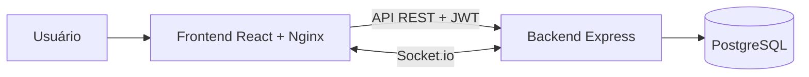

# Nexo

Nexo é uma aplicação Kanban full stack para organizar projetos em quadros,
listas e cartões. O sistema possui autenticação, movimentação por arrastar e
soltar, atualização em tempo real e ambiente completo com Docker.

## Funcionalidades

- Cadastro, login e sessão autenticada com JWT
- Criação, edição e exclusão de quadros
- Criação, renomeação, reordenação e exclusão de listas
- Criação, edição, movimentação e exclusão de cartões
- Arrastar e soltar cartões entre listas
- Atualizações em tempo real com salas privadas por quadro
- Interface responsiva com estados de carregamento, erro e notificações
- Testes de integração da API e testes das regras de movimentação
- Validação automática com GitHub Actions

## Tecnologias

**Frontend**

- React, TypeScript e Vite
- TanStack Query
- Axios e Socket.io Client
- React Router e Lucide React

**Backend**

- Node.js, Express e TypeScript
- Prisma ORM e PostgreSQL
- Socket.io, JWT, bcryptjs e Zod

**Infraestrutura e qualidade**

- Docker Compose e Nginx
- Node Test Runner
- GitHub Actions

## Arquitetura



O frontend utiliza a API REST para persistir alterações e o Socket.io para
receber atualizações do quadro em tempo real. Cada conexão só pode entrar nas
salas dos quadros pertencentes ao usuário autenticado.

## Executar com Docker

### Aplicação completa

Com o Docker Desktop em execução:

```bash
docker compose up -d --build
```

Depois, acesse:

- Aplicação: `http://localhost:5173`
- API: `http://localhost:3333`
- Saúde da API: `http://localhost:3333/health`

As migrações pendentes do Prisma são aplicadas automaticamente ao iniciar o
backend.

Para acompanhar ou encerrar os serviços:

```bash
docker compose ps
docker compose logs -f
docker compose down
```

O comando `docker compose down` não apaga os dados armazenados no volume do
PostgreSQL.

## Desenvolvimento local

### Requisitos

- Node.js 20 ou superior
- npm 10 ou superior
- Docker Desktop

Instale as dependências e crie o arquivo de ambiente do backend:

```bash
npm install
```

```powershell
Copy-Item backend/.env.example backend/.env
```

Inicie o banco:

```bash
docker compose up -d db
```

Em terminais separados, inicie a API e o frontend:

```bash
npm run dev:backend
npm run dev:frontend
```

## Comandos úteis

```bash
# Executa testes, verificação de tipos e build
npm run validar

# Executa somente os testes
npm test

# Cria e aplica uma nova migração
npm run db:migrate --workspace backend -- --name nome_da_migracao

# Abre a interface de dados do Prisma
npm run db:studio --workspace backend
```

## API

Todas as rotas, exceto cadastro e login, exigem o cabeçalho
`Authorization: Bearer <token>`.

| Método | Rota | Ação |
| --- | --- | --- |
| `POST` | `/auth/register` | Cria uma conta |
| `POST` | `/auth/login` | Autentica uma conta |
| `GET` | `/auth/me` | Retorna o usuário autenticado |
| `GET` | `/boards` | Lista os quadros do usuário |
| `POST` | `/boards` | Cria um quadro |
| `GET` | `/boards/:id` | Retorna um quadro com listas e cartões |
| `PATCH` | `/boards/:id` | Atualiza um quadro |
| `DELETE` | `/boards/:id` | Exclui um quadro |
| `POST` | `/boards/:boardId/lists` | Cria uma lista |
| `PATCH` | `/lists/:id` | Atualiza ou move uma lista |
| `DELETE` | `/lists/:id` | Exclui uma lista |
| `POST` | `/lists/:listId/cards` | Cria um cartão |
| `PATCH` | `/cards/:id` | Atualiza ou move um cartão |
| `DELETE` | `/cards/:id` | Exclui um cartão |
| `GET` | `/health` | Verifica a API e o banco |

## Tempo real

A conexão Socket.io exige o JWT em `auth.token`. Após a autenticação, o evento
`join-board` permite entrar somente na sala de um quadro pertencente ao usuário.

Alterações em quadros, listas e cartões são publicadas aos clientes conectados
à mesma sala. O frontend invalida o cache correspondente e sincroniza os dados
sem recarregar a página.

## Estrutura

```text
kanban-projeto/
├── backend/
│   ├── prisma/
│   └── src/
│       ├── configuracao/
│       ├── intermediarios/
│       ├── modulos/
│       ├── tempo-real/
│       └── testes/
├── frontend/
│   └── src/
│       ├── api/
│       ├── componentes/
│       ├── contexto/
│       ├── paginas/
│       ├── tempo-real/
│       └── testes/
├── .github/workflows/
└── docker-compose.yml
```

## Convenção de nomes

Pastas, arquivos, funções, variáveis e mensagens próprias do projeto são
escritos em português sempre que isso mantém o código claro.

Contratos externos permanecem no formato esperado pelas ferramentas e
integrações, incluindo rotas como `/boards`, campos do Prisma como `boardId` e
métodos de bibliotecas como `$transaction`.
